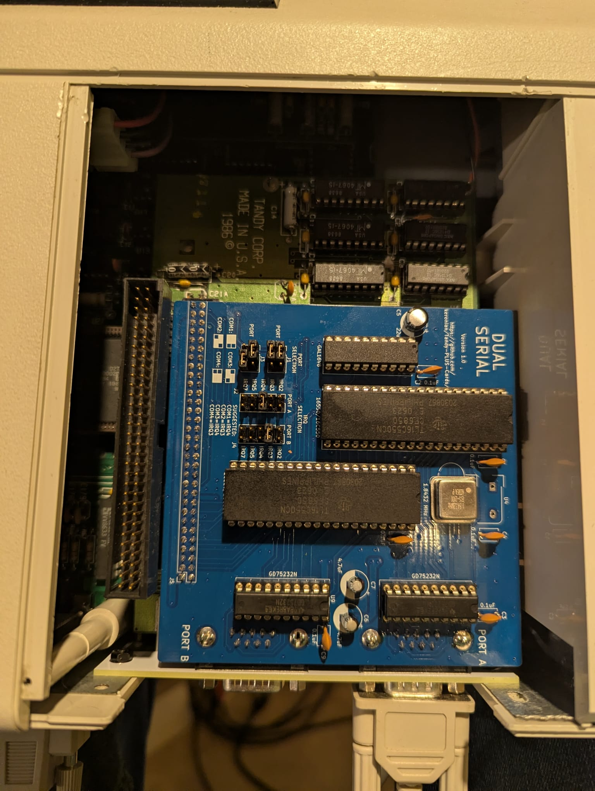
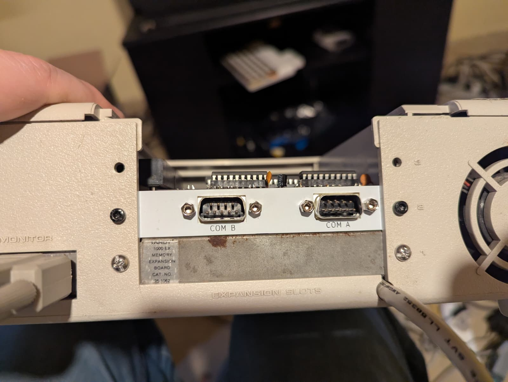
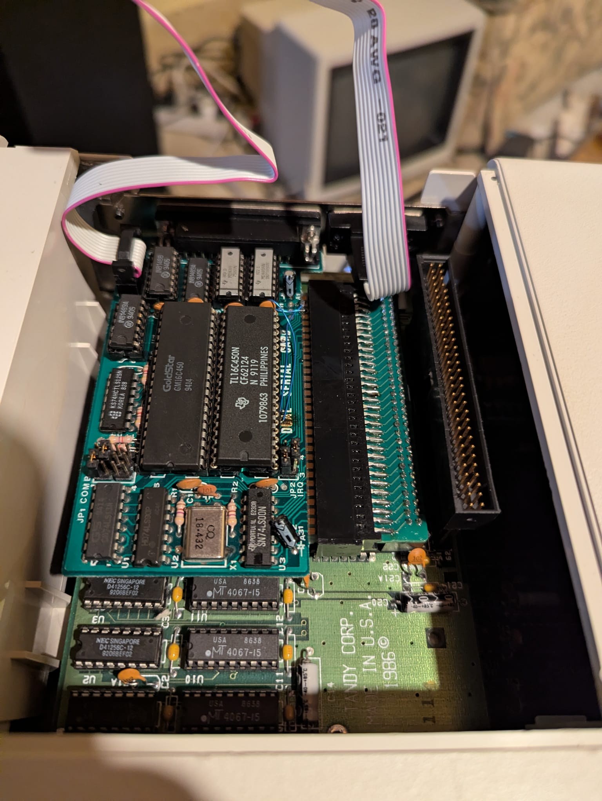

Tandy-PLUS-Cards
================

Tandy PLUS card designs for use in Tandy 1000 EX/HX

I took the work that Jayseon Lee-Steere did creating the Basic and Dual Serial cards as well as the Tandy PLUS Template and used those to create Tandy versions of the Basic and Dual Serial cards.  Additionally, I inverted his ISA to Tandy Plus adapter in order to be able to plug ISA cards into Tandy PLUS slots.  Tandy PLUS Template, EX-HX Combo, and Tandy 1000 Essentials are retained unchanged, but ISA Specific cards were removed to maintain focus for this repo.

Tandy PLUS Template
===================

**Status:** Used to create Dual Serial board

**Description:** A template from which to design cards and/or back plates
for the Tandy 1000 EX/HX computers. Includes approximate board outlines
as measured from Tandy's memory/DMA board, Tandy's serial board and
Rob Krinecki's 3 in 1 board. Includes various notes about safe areas,
potential places to extend the board dimensions, etc.

BasicSerialPlus
===============

**Status:** Untested

**Description:** Adds a single 9 pin serial port to a Tandy 1000 EX/HX. Created with early
Tandy 1000's in mind which have no COM ports from the factory.

Decoding is handled by a 74xx688. Alternatively, a JED file is provided
for programming the needed decode functionality into a GAL16V8/ATF16V8.

**Configuration:** Before installing, configure the port selection jumpers
to a COM port not yet present in the system. Details are located on the
board by the port jumpers. Configure the IRQ jumper to an approriate
selection. For no IRQ, remove the IRQ jumper. Suggested IRQ settings are
located on the board by the IRQ jumper.

DualSerialPlus 1
==============

**Status:** Tested, works great!

**Description:** Adds *two* 9 pin serial ports to a Tandy 1000 EX/HX. Created with early
Tandy 1000's in mind which have no COM ports from the factory.

**Configuration:** Before installing, configure the port selection jumpers
to COM ports not yet present in the system. Details are located on the
board by the port jumpers. Configure the IRQ jumpers to an approriate
selection. For no IRQ, remove the IRQ jumper. Suggested IRQ settings are
located on the board by the IRQ jumpers.

**Note:** The compact nature of the board means that there are some components on the board
near the back of the machine... This may interfere with ports on other Tandy cards, though
it wouldn't be an issue if you have this card in the top position

DualSerialPlusBracket
=====================

**Status:** Tested, but some small modifications were made after seeing how things lined up,
So the new version should be a better fit, but I can't say with certainty

**Description:** Bracket for the above serial card.  Contains mounting holes for multiple
positions.  There are also User Drawings at various positions that can be used to
change the dimensions if a bracket is desired for a specific position

I have also added .step files that are likely a better option... You can get these CNCed out
of sheet metal for pretty cheap... (1.5mm conductive anodized aluminum seems like the best option I can see)
I also shrank the holes on these .step files to allow for tapping for M3 screws, and added a curved edge
for aesthetic / structural support

EX-HX Combo 1, 2
===========

**Status:** Presented unchanged from parent repo for reference.

**Description:** Multiple upgrades for the Tandy 1000 EX/HX
in a single board. It adds the following:
* Up to 384K of additional base memory to bring the EX/HX up
  to 640K
* Up to 160K of upper memory (UMB)
* Rear accessable CF card slot
* XT-IDE BIOS
* Serial port with 16550 UART 
* DS1316 SmartWatch real time clock

Functionality is very similar to Rob Krinecki's 3 in 1/4 in 1 boards,
with the following differences:
* Can be fitted in either the lower or middle board position on the
  EX/HX.
* Can be used together with Tandy's original DMA/memory board. This
  configuration adds DMA functionality and makes the top board 
  position available for a third upgrade board.
* Support for additional upper memory on the Tandy 1000 EX. The EX
  allows for more upper memory than the HX due to the EX having a
  smaller system ROM than the HX. 
* Base and upper memory configuration, COM port selection, COM IRQ,
  ATA (IDE) port address, etc. are configurable via dip switches.
  Using the default settings, the board is equivalent to the proven
  configuration of Rob Krineki's 3 in 1 board.

TandyPlusToISA
==============

**Status:** Tested prototype, works perfectly.  Modified so the bracket is a little closer to the back of the case.
Suggest using thicker copper due to the width of the traces, I used 2oz

**Description:** Allows connection of an ISA card to a Tandy 1000 EX/HX Plus slot.

TandyPlusToISA-Long
===================

**Status:** Untested, but is a copy of the above so I don't expect any issues, also suggest 2oz copper weight

**Description:** Same as the above version, but it's a bit longer in cases that the extra clearance is preferred for things like serial ports

---------------
**1** Construction requires programming of one or
    more GAL16V8/ATF16V8 and/or GAL22V10/ATF22V10 simple programmable
    logic devices. JED file provided. A TL866 or similar programmer
    can program most of these devices.
    
**2** Construction requires programming of the required
    BIOS image into the flash ROM. Most common programmers, such as
    the TL866, can be used for this.
